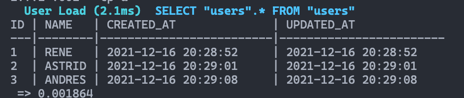
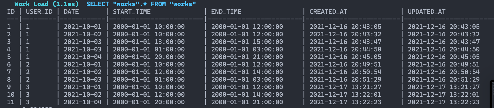
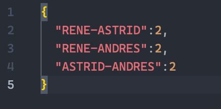

# IOET Challenge

This is a challenge by the Company IOET. 

# Requirements 

The company ACME offers their employees the flexibility to work the hours they want. But due to some external circumstances they need to know what employees have been at the office within the same time frame

The goal of this exercise is to output a table containing pairs of employees and how often they have coincided in the office.

Input: the name of an employee and the schedule they worked, indicating the time and hours. This should be a .txt file with at least five sets of data. You can include the data from our examples below:

## Solution 

### User Model

Params: 

name, type:string

### Work Model

user_id, type: integer
date, type:date
start_time, type:time
end_time, type:time

### 1. End Point -  post `/create`

### 2. End Point -  post `/works`

### 3. End Point -  get `/pairs`

Examples:

Inputs:

Output:

## Built with

- Ruby 2.7.4
- Ruby on Rails 6.1.4.1
- Postgres: >=9.5

## Live demo link

## Setup

Download the repo with this command

`git clone https://github.com/alejandrotoledoweb/ioet_challenge.git`

`cd ioet-challenge`

Install the Gems and Dependencies

`bundle install`

Migrate the database and models, create the seed information

`rails db:create`

`rails db:migrate`

`rails db:seed`

## For the usage

Run the server

`rails server`

Open in the browser `http://localhost:3000/`

## Author

👤 **Alejandro Toledo**

- GitHub: [@alejandrotoledoweb](https://github.com/alejandrotoledoweb)
- Twitter: [@alejot](https://twitter.com/alejot) 
- LinkedIn: [Alejandro Toledo](https://www.linkedin.com/in/alejandro-toledo-freire/) 

## 🤝 Contributing

Contributions, issues and feature requests are welcome!

Feel free to check the [issues page](https://github.com/alejandrotoledoweb/ioet_challenge/issues).

## Show your support

Give a ⭐️ if you like this project!

## Acknowledgments

- Project inspired and challenged by IOET.

## 📝 License

This project is [MIT](https://opensource.org/licenses/MIT) licensed.